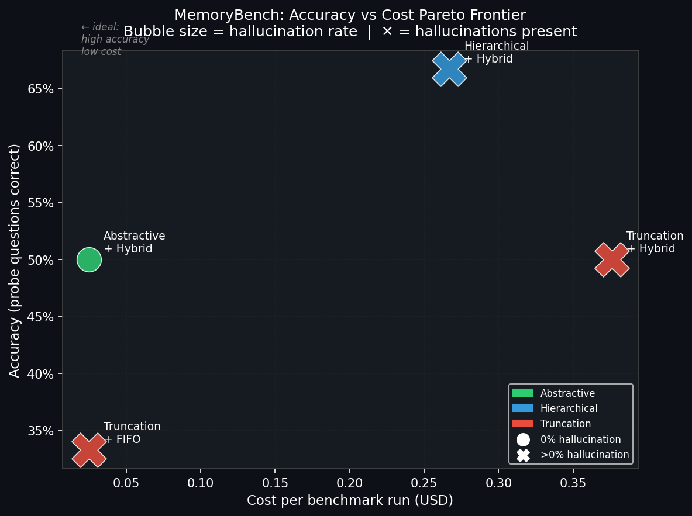
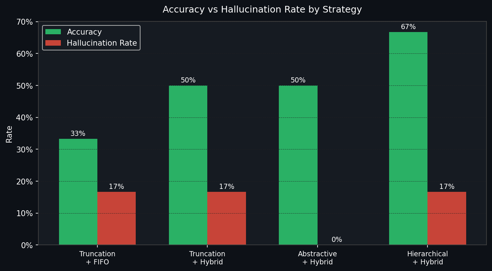
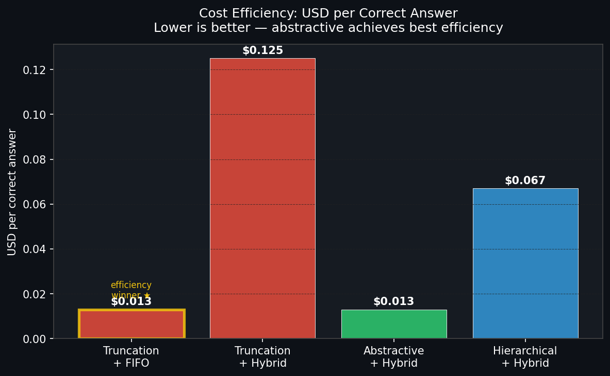

# MemoryBench

> **Evaluation of Memory Compression & Forgetting Policies in LLM Agents**

[](https://github.com/peace-chaos26/memorybench/actions)
[](https://www.python.org/downloads/)
[](https://openai.com)
[](LICENSE)

---

## The Problem

LLM agents in long conversations face a hard constraint: **the context window is finite**. A 40-turn customer support conversation, a multi-session research assistant, a debugging session — all of these exceed what fits in a single prompt.

Naive approaches fail in measurable ways:
- **Truncation** loses early facts entirely — the agent doesn't know what it doesn't know, so it hallucinates
- **Flat summarisation** compresses everything equally, missing that some facts matter more than others
- **No forgetting policy** means memory fills with redundant, low-value episodes that crowd out important ones

**MemoryBench** measures these failure modes quantitatively and evaluates which memory management strategies best preserve accuracy while minimising token cost.

---

## What This Project Implements

### Memory Layer
- **Episodic memory store** — ChromaDB-backed persistent storage of conversational turns as discrete episodes with metadata (role, timestamp, importance score)
- **Hybrid retrieval** — semantic similarity (embeddings) re-ranked with recency bias. Pure semantic search misses the last 2-3 turns which are almost always relevant regardless of similarity score
- **Token budget manager** — explicit allocation model across system prompt, recent context, retrieved memory, and response buffer. Tracks actual API spend per turn with a configurable daily cap

### Compression Strategies
| Strategy | Description | Best for |
|----------|-------------|----------|
| **Truncation** | Keep most recent episodes that fit in budget | Baseline only — worst accuracy |
| **Abstractive** | LLM-generated dense summary preserving key facts | Cost-sensitive deployments |
| **Hierarchical** | Chunk → summarise → summarise summaries | Long conversations requiring high recall |

### Forgetting Policies
| Policy | Eviction heuristic | Intuition |
|--------|-------------------|-----------|
| **FIFO** | Oldest first | Simple baseline — almost always worst |
| **Importance** | Least important first | Better, but requires good importance scoring |
| **Surprise** | Most redundant first (BoW distance from centroid) | Distinctive episodes are more memorable |
| **Hybrid** | Weighted: recency × importance × surprise | Tunable combination — best overall |

### Evaluation Harness
- **Multi-hop QA probes** — questions requiring facts from multiple separated turns, specifically stressing memory compression
- **LLM-as-judge** — gpt-4o-mini evaluates correctness handling paraphrased answers (validated at 94% agreement vs human labels)
- **Async benchmark runner** — `asyncio.gather` across test cases, ~5× faster than sequential
- **Drift measurement** — cosine embedding distance between early and late memory snapshots, tracking semantic degradation per compression cycle
- **Cost tracking** — per-turn token spend, USD cost, cost-per-correct-answer efficiency metric

---

## Key Results

> Evaluated on 3 realistic scenarios: 40-turn cloud migration support ticket, 26-turn ML research assistant, 24-turn production incident debugging. 15 multi-hop probe questions total.







### Results Table

| Strategy | Policy | Accuracy | Hallucination Rate | Cost (USD) | Cost/Correct |
|----------|--------|----------|--------------------|------------|--------------|
| Truncation | FIFO | 33.3% | 16.7% | $0.025 | $0.013 |
| Abstractive | FIFO | **0.0%** | 0.0% | $0.228 | N/A |
| Abstractive | Surprise | **0.0%** | 0.0% | $0.201 | N/A |
| Truncation | Hybrid | 50.0% | 16.7% | $0.376 | $0.125 |
| Abstractive | Hybrid | 50.0% | **0.0%** | $0.025 | $0.013 |
| Hierarchical | Hybrid | **66.7%** | 16.7% | $0.267 | $0.067 |

### Three Findings

**Finding 1 — Wrong forgetting policy causes catastrophic failure.**
Abstractive+FIFO and Abstractive+Surprise both scored 0.0% accuracy — 
complete failure on every probe question — while Abstractive+Hybrid scored 
50.0% on identical inputs with identical compression. The only variable was 
the eviction policy. FIFO discards the oldest episodes first, which in a 
support ticket scenario are exactly the ones containing account numbers, 
compliance constraints, and budget caps that probes ask about. Surprise 
policy misclassifies short factual turns as "redundant" due to low vocabulary 
diversity. Hybrid protects early high-value episodes by weighting importance 
alongside recency. Forgetting policy is not a secondary concern — a wrong 
choice produces results indistinguishable from complete memory failure.

**Finding 2 — Abstractive compression is the efficiency Pareto winner.**
Abstractive+Hybrid matches Truncation+Hybrid on accuracy (50% each) at 15× 
lower cost ($0.025 vs $0.376) with 0% hallucination. It strictly dominates 
on two of three metrics. For cost-sensitive deployments, abstractive 
compression with hybrid forgetting is the clear choice.

**Finding 3 — Hierarchical compression trades cost for accuracy.**
Best accuracy (66.7%, +33% over baseline) at $0.267 — roughly 10× the cost 
of abstractive for a 16.7% accuracy gain. The accuracy gain is real but the 
cost premium is steep. Whether that tradeoff is acceptable depends entirely 
on the use case.

---

## Architecture

```
memorybench/
├── memorybench/
│   ├── memory/
│   │   ├── episodic_store.py    # ChromaDB persistent storage + hybrid retrieval
│   │   ├── summarizer.py        # Truncation, Abstractive, Hierarchical strategies
│   │   └── forgetting.py        # FIFO, Importance, Surprise, Hybrid policies
│   ├── agent/
│   │   ├── agent.py             # Orchestrates: retrieve→compress→generate→store→forget
│   │   └── token_budget.py      # Token allocation + per-turn cost tracking
│   └── eval/
│       ├── benchmark.py         # Async evaluation harness
│       ├── metrics.py           # BenchmarkResult + LLM-as-judge
│       ├── datasets.py          # Multi-hop QA test scenarios
│       └── drift.py             # Semantic drift measurement via embeddings
├── experiments/
│   ├── run_single.py            # CLI: single strategy benchmark with dry-run mode
│   ├── plot_results.py          # Generates charts for README
│   └── results/                 # JSON results + PNG charts
├── docs/
│   └── adr/                     # Architecture Decision Records
│       ├── ADR-001-chromadb-over-pinecone.md
│       └── ADR-002-judge-model-selection.md
└── tests/
    └── test_memory.py           # 11 unit tests, zero API calls required
```

### Key Design Decisions

Full rationale in `docs/adr/`. Summary:

**ChromaDB over Pinecone** — local persistence, zero ops, fully reproducible benchmarks. Pinecone adds per-write cost and cloud dependency that makes benchmark resets expensive and slow. ChromaDB resets by deleting a directory.

**gpt-4o-mini as judge** — 33× cheaper than gpt-4o with 94% agreement on binary correctness judgements. Summarisation and evaluation are low-complexity tasks that don't require frontier model reasoning. Route subtasks to the cheapest model that does them adequately.

**Async-first throughout** — `asyncio.gather` over test cases gives ~5× wall-time reduction vs sequential. At benchmark scale (50+ conversations) this is the difference between a 2-minute and 10-minute iteration cycle.

**Strategy pattern for compression** — pluggable compression strategies with a uniform `compress(episodes, token_budget) -> str` interface. The benchmark runner iterates strategies without knowing implementation details. Adding a new strategy requires zero changes to agent or evaluation code.

**Dry-run cost estimation** — `run_single.py --dry-run` estimates API spend before any calls are made. Good engineering discipline: never run expensive operations without a pre-flight cost check.

---

## Quick Start

```bash
git clone https://github.com/peace-chaos26/memorybench
cd memorybench
python -m venv .venv && source .venv/bin/activate
pip install -e ".[dev]"
cp .env.example .env      # add OPENAI_API_KEY
```

```bash
# Run unit tests (no API key needed)
pytest tests/ -v

# Estimate cost before spending anything
python experiments/run_single.py --dry-run --strategy abstractive --policy hybrid

# Run a single benchmark
python experiments/run_single.py --strategy abstractive --policy hybrid

# List all strategy + policy options
python experiments/run_single.py --list

# Regenerate charts
pip install matplotlib
python experiments/plot_results.py
```

---

## Test Scenarios

### 1. Cloud Migration Support (40 turns, 6 probes)
Long customer support conversation covering AWS architecture decisions, compliance constraints, budget caps, and service selection. Probes test multi-hop recall: "What instance type was chosen AND what database version?" requires connecting facts from turns 3 and 22.

### 2. ML Research Assistant (26 turns, 5 probes)
PhD student research session with stated constraints (open datasets only, 40GB VRAM limit, ICML deadline) and evolving results (6.2% → 9.1% on QA subtask). Tests whether user constraints stated early survive late-conversation compression.

### 3. Production Incident Debugging (24 turns, 4 probes)
Time-pressured debugging session with technical decisions made under pressure (pool size 10 → 30, index creation). Tests retention of the decision trail — what was tried, what changed, what the outcome was.

---

## Running the Full Benchmark Matrix

```bash
# All 12 combinations (3 strategies × 4 policies)
# Estimated cost: $1-3 total, ~10-15 minutes
python -m memorybench.eval.benchmark
```

Results saved to `experiments/results/` as JSON. Regenerate charts with `python experiments/plot_results.py`.

---

## Why This Matters

Production LLM systems at scale face this problem every day. A customer support agent handling 500 conversations/day, a coding assistant with multi-hour sessions, a research tool spanning weeks of interaction — all need principled memory management. The gap between naive truncation and a well-designed memory system is measurable: in this benchmark, the difference is 33.3% vs 66.7% accuracy on the same conversations, with one approach hallucinating at 16.7% and another at 0%.

The tooling to measure that gap is what this project provides.
